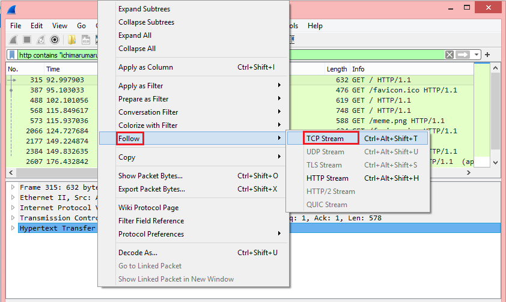
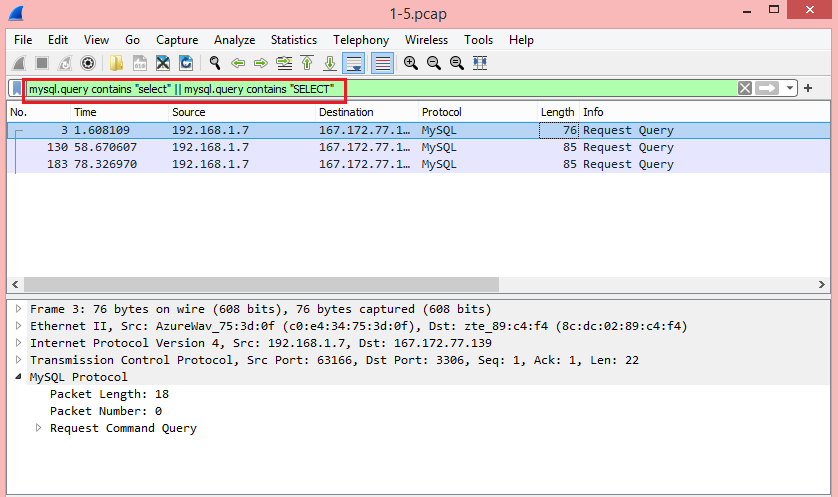
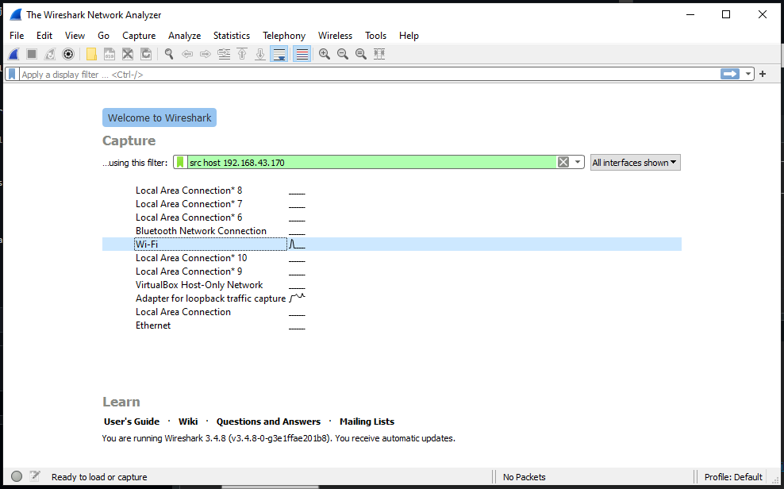

# Jarkom-Modul-1-E14-2021

**Anggota kelompok**:
- Dwi Wahyu Santoso (05111840000121)
- Husin Muhammad Assegaff (05111940000127)
- Khaela Fortunela (05111940000057)

---
## Tabel Konten
A. Jawaban
- [Soal 1](#soal-1)
- [Soal 2](#soal-2)
- [Soal 3](#soal-3)
- [Soal 4](#soal-4)
- [Soal 5](#soal-5)
- [Soal 6](#soal-6)
- [Soal 7](#soal-7)
- [Soal 8](#soal-8)
- [Soal 9](#soal-9)
- [Soal 10](#soal-10)
- [Soal 11](#soal-11)
- [Soal 12](#soal-12)
- [Soal 13](#soal-13)
- [Soal 14](#soal-14)
- [Soal 15](#soal-15)

B. Kendala
- [Kendala](#kendala)

## Soal 1
Sebutkan webserver yang digunakan pada "ichimarumaru.tech"!

**Pembahasan:**
- Dilakukan filter dengan `http contains ichimarumaru.tech`.

- Kemudian klik kanan pada salah satu paket, pilih Follow, lalu TCP Stream.
- Maka akan terlihat bahwa Web server yang digunakan adalah nginx/1.18.0.

## Soal 2
Temukan paket dari web-web yang menggunakan basic authentication method!

**Pembahasan:**
- Dilakukan filter dengan `http.authbasic`.
- Kemudian klik kanan pada salah satu paket, pilih Follow, lalu TCP Stream.
- Maka akan terlihat bahwa metode authentication yang digunaan adalah basic.

## Soal 3
Ikuti perintah di basic.ichimarumaru.tech! Username dan password bisa didapatkan dari file .pcapng!

**Pembahasan:**
- Dilakukan filter dengan `http.host contains basic.ichimarumaru.tech`.
- Kemudian pilih salah satu paket, dan ditemukan informasi sebagai berikut.
  + Username: kuncimenujulautan
  + Password: tQKEJFbgNGC1NCZlWAOjhyCOm6o3xEbPkJhTciZN

- Setelah itu, username dan password dimasukkan pada `basic.ichimarumaru.tech` dan diminta untuk memasukkan urutan konfigurasi kabel T568A

## Soal 4
Temukan paket mysql yang mengandung perintah query select!

**Pembahasan:**
- Dilakukan filter dengan `mysql contains SELECT`.
- Kemudian klik kanan pada salah satu paket, pilih Follow, lalu TCP Stream.
- Maka akan terlihat bahwa paket mysql tersebut mengandung perintah SELECT.

## Soal 5
Login ke portal.ichimarumaru.tech kemudian ikuti perintahnya! Username dan password bisa didapat dari query insert pada table users dari file .pcap!

**Pembahasan:**

## Soal 6
Cari username dan password ketika melakukan login ke FTP Server!

**Pembahasan:**

- Menggunakan filter `ftp contains "USER"`
- Kemudian klik kanan terdapat Follow, lalu TCP Stream
- Setelah itu, maka akan terlihat username dan password login ke FTP Server yakni,

    username : secretuser  
    password : aku.pengen.pw.aja

    

## Soal 7
Ada 500 file zip yang disimpan ke FTP Server dengan nama 0.zip, 1.zip, 2.zip, ..., 499.zip. Simpan dan Buka file pdf tersebut. (Hint = nama pdf-nya "Real.pdf")

**Pembahasan:**

- Menggunakan filter `tcp contains “Real.pdf”`
- Kemudian klik kanan terdapat Follow, lalu TCP Stream
- Setelah itu ubah penampilan data menjadi raw, dan simpan di folder lokal dengan format .zip
    
- Kemudian extract zip dan **Real.pdf** dapat dibuka.
    

## Soal 8
Cari paket yang menunjukan pengambilan file dari FTP tersebut!

**Pembahasan:**
- Menggunakan filter `ftp.request.command`
- Hasilnya didapatkan sebagai berikut, tidak ada command “RETR” yang menandakan pengunduhan gambar. 
    

## Soal 9
Dari paket-paket yang menuju FTP terdapat inidkasi penyimpanan beberapa file. Salah satunya adalah sebuah file berisi data rahasia dengan nama "secret.zip". Simpan dan buka file tersebut!

**Pembahasan:**
- Menggunakan filter `ftp-data.command contains “secret.zip”`
- Kemudian klik kanan Follow, lalu TCP Stream
- Setelah itu, ubah penampilan data menjadi raw, dan simpan di folder lokal dengan format .zip dengan nama **secret.zip**
- Kemudian di-extract. Namun, ternyata file .zip tersebut terdapat password
    
- Lanjutannya di nomor 10

## Soal 10
Selain itu terdapat "history.txt" yang kemungkinan berisi history bash server tersebut! Gunakan isi dari "history.txt" untuk menemukan password untuk membuka file rahasia yang ada di "secret.zip"!

**Pembahasan:**
- Dilakukan filter `ftp-data.command contains “history.txt”`
- Kemudian, terdapat tampilan sebagai berikut
    
- Lalu klik kanan follow, kemudian TCP stream. Lalu di-download sebagai RAW dengan nama file **history.txt**
- Kemudian, didapatkan hasil sebagai berikut,
    
- Lalu, karena terdapat nama file **bukanapaapa.txt**, maka dicoba untuk memeriksa isi file tersebut dengan filter `ftp-data.command contains "bukanapaapa.txt"`
- Didapatkan hasil sebagai berikut,
    
- Lalu klik kanan Follow, kemudian TCP Stream dan download file dengan format RAW dengan nama **bukanapaapa.txt**
- Dan isi filenya sebagai berikut,
    
- Kemudian, dari kalimat tersebut dicoba dimasukkan ke password .zip pada file **secret.zip**
- Dan hasilnya terdapat file **Wanted.pdf** yang isinya sebagai berikut,
    

## Soal 11
Filter sehingga wireshark hanya mengambil paket yang berasal dari port 80!

**Pembahasan:**
- Filter yang perlu dijalankan adalah `src port 80`.

- Kemudian mengakses situs `monta.if.its.ac.id` pada browser.
- Gambar berikut menunjukan hasil capture filter paket yang berasal dari port 80.

## Soal 12
Filter sehingga wireshark hanya mengambil paket yang mengandung port 21!

**Pembahasan:**
- Filter yang perlu dijalankan adalah `port 21`.

- Kemudian menjalankan perintah `wget ftp://ftp.unicode.org/public/unidata/unicodedata.txt` di terminal.
- Gambar berikut menunjukkan capture filter paket yang mengandung port 21.

- Tetapi, jika tidak menggunakan poin b, maka hasilnya akan kosong seperti berikut.

## Soal 13
Filter sehingga wireshark hanya menampilkan paket yang menuju port 443!

**Pembahasan:**
- Filter yang perlu dijalankan adalah `dst port 443`.

- Kemudian mengakses situs `its.ac.id` pada browser.
- Gambar berikut menunjukkan capture filter paket yang menuju port 443.

## Soal 14
Filter sehingga Wireshark hanya mengambil paket yang tujuannya ke `kemenag.go.id`!

**Pembahasan:**
- Filter yang perlu dijalankan adalah `dst host kemenag.go.id`.

- Kemudian mengakses situs `kemenag.go.id` pada browser.
- Gambar berikut menunjukkan capture filter paket yang menuju `kemenag.go.id`.

## Soal 15
Filter sehingga wireshark hanya mengambil paket yang berasal dari ip kalian!

**Pembahasan:**
- Untuk mendapatkan ip address, jalankan `ipconfig` pada terminal. Sehingga diketahui bahwa ip saya adalah `192.168.43.170`.

- Filter yang perlu dijalankan adalah `src host 192.168.43.170`.

- Kemudian mengakses situs `kemenag.go.id` pada browser.
- Gambar berikut menunjukkan capture filter paket yang berasal dari ip saya.

## Kendala
Selama pengerjaan praktikum ini kendala yang dialami terkadang bingung dalam penggunaan filter sesuai dengan permintaan soal

